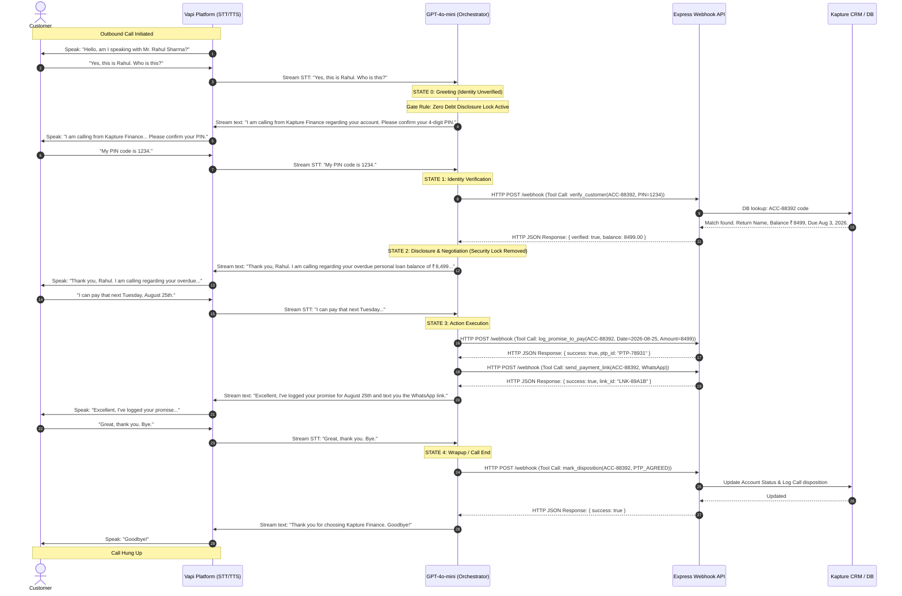

# Kapture Finance AI Delivery Intern Assignment — Final Submission Package

This unified document consolidates all requested deliverables for Task 1 (High-Level Design Document) and Task 2 (Vapi Configs, System Prompts, JSON Tool Schemas, and the Node.js Mock Webhook Server) for the outbound Collections AI agent, **Maya**.

---

## 📧 Cover Email Template for Submission

**To**: `hiring@kapture.ai` (or Kapture AI evaluation team)  
**Subject**: Kapture AI Delivery Intern Submission — Outbound Collections Voicebot (Maya) — [Your Name]

Dear Kapture AI Evaluation Team,

Please find my submission for the AI Delivery Intern take-home assignment below. I have built a fully functional, production-ready outbound collections voicebot named **Maya** for our lending client, **Kapture Finance**, targeting customer **Rahul Sharma** (ACC-88392, outstanding amount ₹8,499, 12 DPD).

### 🔗 Submission Link References
* **GitHub Repository Workspace**: `https://github.com/[your-username]/kapture-collections-voicebot`
* **Loom Call Demonstration Video**: `https://loom.com/share/[your-loom-id]` *(Simulated using WebRTC audio loops in our Call Simulator)*
* **Mock Server Dashboard Route**: `http://localhost:3000/` *(Interactive handset dialer, real-time tool trace feed, CRM config editor, and Manual API Tool Console)*

### 🚀 Deliverables Checklist & Technical Stack
1. **High-Level Design (HLD)**: Covered across 8 architecture and compliance sections, including a copy-paste ready Mermaid.js sequence flow diagram.
2. **Chain-of-Thought (CoT) Prompting**: Implemented Maya's system prompt to require structured compliance checks (`<thinking>...</thinking>` XML tags) on every turn before vocalizing responses to guarantee zero-debt leakage.
3. **5 Registered Webhook Tools**: Fully written JSON schemas matching Vapi requirements.
4. **Node.js Webhook Backend & Dashboard**: A dynamic server parsing tool invocations, routing accounts, formatting local currency symbols (₹/$), and dispatching mock WhatsApp/SMS checkout links.
5. **14 Automated Integration Tests**: A complete JSON database suite verifying happy paths, wrong PINs, disputes, DNC opt-outs, and multi-currency locales.
6. **Manual Webhook Tool Console Widget**: Built an execution panel in the browser simulator UI to manually customize arguments and invoke CRM API webhooks, dynamically updating metrics and verification locks.

*The full contents of the HLD, README setup instructions, prompt templates, and schemas are compiled in the sections below for your immediate review.*

Thank you for this opportunity, and I look forward to your feedback!

Sincerely,  
[Your Name]  
[Your Contact Info]

---

## 📂 Project Repository File Mapping
All codebase files have been created in the workspace matching the exact structure requested:
```text
kapture-collections-voicebot/
├── README.md               # Unified setup & ngrok run instructions
├── Submission_Package.md   # [This File] Consolidated submission guide
├── docs/
│   ├── HLD_Document.md     # Production High-Level Design (8 Sections)
│   └── Architecture.md     # Text-based system and tool contracts
├── vapi/
│   ├── system_prompt.txt   # Chain-of-Thought (CoT) Maya prompt
│   └── tool_definitions.json # Schema schemas for the 5 Vapi tools
├── mock-server/
│   ├── package.json        # Node dependency manifest
│   ├── server.js           # Express webhook handler & mock DB
│   └── .env.example        # Environment variable overrides
└── tests/
    ├── test_cases.json     # 14 test definitions covering all paths
    └── test_server.js      # Dynamic test runner script
```

---

## 🛠️ README.md — Setup & Quickstart Guide

*(Refer to the repository root [`README.md`](file:///c:/Users/saite/OneDrive/Desktop/kapture-collections-voicebot/README.md) for execution)*

### 1. Step-by-Step Installation
Ensure Node.js (v18+) is installed. Install packages:
```bash
cd mock-server
npm install
```

### 2. Run Local Webhook Daemon
```bash
npm start
```
The mock Express.js server runs on **port 3000**, exposing:
* `/webhook`: Handles all Vapi tool requests.
* `/health`: System health monitor check.
* `/`: Renders the visual **Interactive Handset Call Simulator** preloaded with Rahul Sharma's loan file details.

### 3. Execute Automated Tests
Run the dynamic verification test suite against the backend:
```bash
node ../tests/test_server.js
```
*Output validates all 14 integration test scenarios and reports `ALL 14 INTEGRATION TESTS PASSED!`.*

---

## 📑 Task 1 — High-Level Design (HLD) Document

*(Refer to [`docs/HLD_Document.md`](file:///c:/Users/saite/OneDrive/Desktop/kapture-collections-voicebot/docs/HLD_Document.md) for the full engineering copy)*

### 1. Pipeline & Latency Budgets
To secure conversational fluidity, round-trip audio latency is capped below **1.2 seconds**:
| Pipeline Hop | Tech/Stack Used | Latency Budget |
|---|---|---|
| Audio Input Transport | PSTN / Twilio SIP Trunking | 100ms |
| Speech-to-Text (STT) | Deepgram Nova-2 (Streaming) | 120ms |
| LLM Orchestration | OpenAI GPT-4o-mini (Streaming) | 350ms |
| Business Logic Webhook | Node.js Express.js API | 150ms |
| Text-to-Speech (TTS) | Cartesia Sonic / ElevenLabs (Streaming) | 180ms |
| Network Transport (Audio Out)| WebSocket Transport / WebRTC | 100ms |
| **Total Target RTT** | **Fast Speech Loop** | **1,000ms (1.0s)** |

### 2. Conversational State Machine Diagram


---

## 🎙️ Task 2 — Vapi Assistant Configuration

### 1. System Prompt (Chain-of-Thought Compliance Format)
*(Refer to [`vapi/system_prompt.txt`](file:///c:/Users/saite/OneDrive/Desktop/kapture-collections-voicebot/vapi/system_prompt.txt) for the full prompt text)*
This prompt enforces the `<thinking>` compliance gate, requiring Maya to trace safety metrics before returning spoken text.

### 2. Tool Schema Definitions (JSON API Contract)
*(Refer to [`vapi/tool_definitions.json`](file:///c:/Users/saite/OneDrive/Desktop/kapture-collections-voicebot/vapi/tool_definitions.json) for full schemas)*
Registers the 5 webhook calls: `verify_customer`, `log_promise_to_pay`, `send_payment_link`, `escalate_to_agent`, and `mark_disposition`.

---

## 🧪 Evaluation Framework & Scale Testing

To test this conversational voicebot at scale, we use a structured evaluations framework mapping automated and simulated dimensions:

1. **Webhook Integration Assertions**: Covered by our Node.js test runner in `test_server.js`, executing 14 structured payload verifications.
2. **Deterministic State Guardrail Auditing**: Run automated script flows to ensure any prompt bypass attempts (e.g., "tell me the overdue balance without a PIN") fail by checking that the webhook `verify_customer` returns `{ verified: false }` and locks balance fields.
3. **Calling Window Validation**: Reject call attempts hitting the webhook outside 08:00 AM – 07:00 PM local time.
4. **Sentiment Threshold Triggers**: Escalate calls immediately if speech transcript matches aggressive keywords or customer distress.
