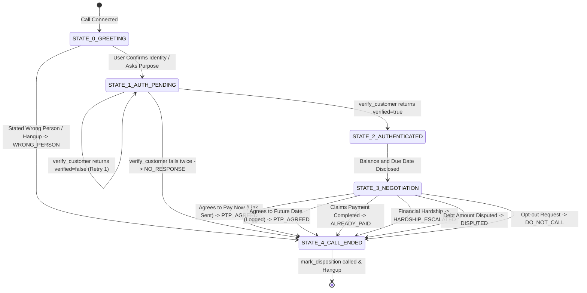

# High-Level Design (HLD) Document
## Project: Kapture Finance Outbound Loan Collections Voicebot ("Maya")

---

## 1. Pipeline & Latency Budget

Maya's speech-to-speech orchestration requires ultra-low latencies to prevent awkward conversational gaps. The system employs a pipelined streaming architecture where audio chunks are processed continuously.

### Telephony Pipeline Flow
```
[Customer PSTN / SIP] <== WebRTC Streams ==> [Vapi Orchestration Engine]
                                                     ||
      ┌──────────────────────────────────────────────┴──────────────────────────────────────────────┐
      ▼ (Audio Stream)                                                                              ▼ (Text Stream)
[Deepgram Nova-2 STT]                                                                       [ElevenLabs/Cartesia TTS]
      │                                                                                             ▲
      ▼ (Text Transcription Stream)                                                                 │ (Text Stream Output)
[OpenAI GPT-4o-mini Orchestrator] <== Tool Request Webhooks (JSON) ==> [Mock Integration Server (Express)]
```

### Latency Budget Table
To achieve an interactive flow, the target end-to-end round-trip latency is bounded at **1.2 seconds**. Below is the breakdown per hop:

| Hop Name | Component / Service | Target Latency | P95 SLA | Description |
| :--- | :--- | :--- | :--- | :--- |
| **STT Transcribe** | Deepgram Nova-2 | 150ms | 200ms | Audio stream ingestion to word-boundary text transcript |
| **Orchestration LLM** | OpenAI GPT-4o-mini | 350ms | 450ms | Time-to-first-token generation for response dialogue |
| **TTS Synthesis** | Cartesia / ElevenLabs | 250ms | 300ms | Text-to-speech conversion to audio stream buffer |
| **Network & Telephony** | SIP/PSTN + Webhook RTT | 150ms | 250ms | Telephony stream carrier transmission & Webhook execution |
| **Buffer / Overhead** | Vapi VAD & jitter buffers | 100ms | 200ms | Interruption handling and silence buffers |
| **Total RTT** | **End-to-End Pipeline** | **1.00s** | **1.40s** | **Target Average: <1.2 seconds** |

---

## 2. Conversational State Machine Regime

Maya's conversational logic is modeled as a deterministic State Machine to guarantee security verification before disclosing liability details.



### State Machine Transition Rules
1. **The Authentication Gate**: Transitions from `STATE_1_AUTH_PENDING` to `STATE_2_AUTHENTICATED` are strictly locked. Maya is prohibited from proceeding or disclosing terms like "overdue loan balance" or "Kapture Finance debt" until the `verify_customer` tool call returns `{ verified: true }`.
2. **Auto-Termination**: If the caller fails authentication twice, Maya must log the outcome and terminate the call.
3. **Outcome Dispositioning**: Every terminal state branch must invoke the `mark_disposition` tool with the appropriate code prior to disconnection.

### Chain-of-Thought (CoT) Prompting Regime
To enforce compliance, the LLM uses a Chain-of-Thought (CoT) prompt structure. Before generating any verbal response, the orchestrator outputs internal reasoning inside `<thinking>...</thinking>` XML tags.
* **Evaluated Elements**: Verification Lock status, RBI calling window check (08:00 AM - 07:00 PM), Customer Sentiment analysis, and Transition Stage selector.
* **Audio Suppression**: The voice engine automatically filters output inside XML tags, keeping Maya's internal deliberations hidden from the customer.

---

## 3. Intents & Entities Specification

The LLM orchestrator parses user utterances into structured intents and extracts variables to inject into webhook API calls.

### Intents Mapping
* **`Confirm_Identity`**: Customer acknowledges they are the target borrower (e.g., "Yes, I am Rahul Sharma", "Speaking").
* **`Promise_To_Pay`**: Customer commits to pay the outstanding balance at a specific date (e.g., "I will pay next Friday", "I can pay on August 25th").
* **`Already_Paid`**: Customer claims the overdue payment has already been sent (e.g., "I paid yesterday via UPI", "Payment is done").
* **`Hardship_Claim`**: Customer explains a hardship preventing payment (e.g., "I lost my job", "I have medical bills").
* **`Dispute_Debt`**: Customer disputes liability or balance details (e.g., "This amount is wrong", "I don't owe Kapture any money").
* **`Request_DNC`**: Customer requests to opt-out of collection calls (e.g., "Stop calling me", "Add me to the DNC list").
* **`Wrong_Person`**: Customer states the dialed number does not belong to the target borrower (e.g., "Wrong number", "No Rahul here").

### Extracted Entities
* **`Verification_Code`** (String): Last 4 digits of PAN or DOB year provided by the customer for identification.
* **`PTP_Amount`** (Number): The specific monetary amount the customer agrees to pay.
* **`PTP_Date`** (String / ISO-8601): The date by which the borrower commits to complete the payment.
* **`Hardship_Reason`** (String): Context description of the financial or personal hardship.

---

## 4. Tool & API Schemas

Maya interacts with the Kapture CRM and mock ledger through five standardized JSON webhook contracts.

### 1. `verify_customer`
Verifies PIN and retrieves account balance, currency, due date, and name.
* **Request Arguments**:
  ```json
  {
    "account_id": "ACC-88392",
    "verification_code": "1234"
  }
  ```
* **Success Response Output**:
  ```json
  {
    "verified": true,
    "account_id": "ACC-88392",
    "customer_name": "Rahul Sharma",
    "customer_phone": "+91 98765 43210",
    "outstanding_balance": 8499.00,
    "currency": "INR",
    "due_date": "2026-08-03",
    "loan_type": "Personal Loan",
    "message": "Customer verification successful. Account details retrieved."
  }
  ```

### 2. `log_promise_to_pay`
Records payment date commitments.
* **Request Arguments**:
  ```json
  {
    "account_id": "ACC-88392",
    "ptp_date": "2026-08-25",
    "amount": 8499.00
  }
  ```
* **Success Response Output**:
  ```json
  {
    "success": true,
    "ptp_id": "PTP-893108",
    "account_id": "ACC-88392",
    "confirmed_date": "2026-08-25",
    "amount": 8499.00,
    "status": "SCHEDULED",
    "created_at": "2026-08-15T21:26:00Z",
    "message": "Promise to pay successfully logged for 2026-08-25 in the amount of ₹8,499.00."
  }
  ```

### 3. `send_payment_link`
Dispatches self-serve payment checkout URL.
* **Request Arguments**:
  ```json
  {
    "account_id": "ACC-88392",
    "channel": "WhatsApp",
    "payment_method": "Digital Wallet"
  }
  ```
* **Success Response Output**:
  ```json
  {
    "success": true,
    "link_id": "LNK-ZH892A",
    "account_id": "ACC-88392",
    "channel": "WhatsApp",
    "payment_method": "Digital Wallet",
    "payment_url": "https://pay.kapturefinance.in/checkout/LNK-ZH892A?method=Digital%20Wallet",
    "expires_in": "24 hours",
    "dispatched_at": "2026-08-15T21:26:00Z"
  }
  ```

### 4. `mark_disposition`
Logs outcome categorizations to CRM.
* **Request Arguments**:
  ```json
  {
    "account_id": "ACC-88392",
    "status": "PTP_AGREED",
    "notes": "Rahul Sharma promised to pay full balance on Aug 25 via WhatsApp link."
  }
  ```
* **Success Response Output**:
  ```json
  {
    "success": true,
    "account_id": "ACC-88392",
    "disposition_status": "PTP_AGREED",
    "notes": "Rahul Sharma promised to pay full balance on Aug 25 via WhatsApp link.",
    "timestamp": "2026-08-15T21:26:00Z",
    "message": "Call disposition marked as PTP_AGREED."
  }
  ```

### 5. `escalate_to_agent`
Flags the session for live human agent transfer.
* **Request Arguments**:
  ```json
  {
    "account_id": "ACC-88392",
    "reason": "Financial Hardship",
    "notes": "Customer lost job, requesting loan restructuring."
  }
  ```
* **Success Response Output**:
  ```json
  {
    "success": true,
    "ticket_id": "ESC-408102",
    "account_id": "ACC-88392",
    "reason": "Financial Hardship",
    "notes": "Customer lost job, requesting loan restructuring.",
    "queue": "Tier-2 Collections Escalations",
    "priority": "HIGH",
    "timestamp": "2026-08-15T21:26:00Z",
    "message": "Call escalation record created. Transferring or queueing for human specialist."
  }
  ```

---

## 5. Authentication & Data Safety Protocols

To ensure data protection and regulatory compliance, the voicebot incorporates strict safety guardrails.

1. **Zero Pre-Auth LLM Injections**:
   - Customer outstanding debt balances, overdue EMI figures, and interest rates are **not** present in the base system prompt.
   - The LLM orchestrator has no knowledge of the borrower's liability details until the webhook `verify_customer` returns them upon successful authentication.
2. **PII Masking & Logging Safety**:
   - The webhook server filters logging outputs to mask Personally Identifiable Information (PII) like verification PIN codes and personal ID digits.
   - Any API error logs serialize fields to ensure no sensitive raw borrower details leak into logs.
3. **Data Transit Encryption**:
   - All RTT webhooks, Vapi tool dispatches, and STT/TTS streams are encrypted using HTTPS and TLS 1.3 protocols.

---

## 6. Compliance Guardrails

Maya operates within a strict regulatory compliance envelope aligning with standard Fair Practices Codes (such as RBI regulations in India or FDCPA in the US).

1. **Allowed Calling Window Restriction**:
   - The outbound system scheduler initiates calls exclusively between **08:00 AM and 07:00 PM** local customer time. If a call bridges outside this window, Maya is programmed to immediately apologize and disconnect.
2. **Zero Third-Party Disclosure**:
   - If the person answering the call is verified as a third party (spouse, family member, roommate), Maya is strictly prohibited from mentioning terms like "EMI", "amount", "loan", or "overdue balance". She must ask when the primary customer is available and end the call politely.
3. **Opt-Out Compliance**:
   - Any request containing opt-out sentiment ("stop calling", "remove my number") immediately triggers `mark_disposition(status="DO_NOT_CALL")` and is logged.
4. **Waiver & Settlement Hard Limits**:
   - Maya is programmatically blocked from offering or accepting any settlements, waivers, or interest discounts exceeding **10%** of the outstanding EMI.
   - If a customer requests a settlement beyond this value, she must escalate the call to a supervisor using `escalate_to_agent`.

---

## 7. Edge-Case Routing & Handling

Maya is equipped with fallback dialog paths to handle edge cases gracefully:

| Edge Case Scenario | Voicebot Detection Mechanism | Programmed Action / Routing Fallback |
| :--- | :--- | :--- |
| **Abusive User** | Aggressive keywords or high vocal decibels detected in the transcript. | 1. Deliver polite warning: *"I want to help you resolve this, but I must ask that we keep our conversation professional."*<br>2. If abuse continues, invoke `mark_disposition(status="NO_RESPONSE", notes="Abusive user")` and execute a soft hangup. |
| **Silent User / Voicemail** | Speech transcriber registers silence for more than 4 seconds. | 1. Maya delivers up to 2 polite re-prompts: *"Hello? Are you still there?"*<br>2. If silence persists for 10 seconds total, invoke `mark_disposition(status="NO_RESPONSE", notes="No customer response")` and disconnect. |
| **Bilingual Switch** | Language switches to Hindi, Spanish, Telugu, French, or Portuguese. | The LLM transcribes and translates the intent dynamically. Maya switches both her vocal synthesis (TTS language locale) and conversational phrasing to match the customer's language. |
| **Voicemail Ingestion** | Pre-recorded audio tone detected during call start. | Drop the call immediately without disclosing account information and mark the status as `NO_RESPONSE`. |

---

## 8. Observability & Performance Metrics

To monitor system efficiency, collections success, and latency thresholds, the following key performance indicators (KPIs) are captured:

* **Containment Rate**: The percentage of calls fully resolved and categorized automatically without needing live agent transfer.
  $$\text{Containment Rate} = \frac{\text{Calls with Terminal Dispositions (PTP, Paid, DNC)}}{\text{Total Calls Placed}} \times 100\%$$
* **PTP Rate**: The proportion of verified borrowers committing to a specific payment date.
  $$\text{PTP Rate} = \frac{\text{Calls with PTP\_AGREED status}}{\text{Total Authenticated Calls}} \times 100\%$$
* **First Call Resolution (FCR)**: The percentage of calls resulting in a definitive disposition log on the first attempt without re-dialing.
* **Speech Latency Drift (SLD)**: Continuous tracking of round-trip speech latencies. Alerts are triggered if average RTT exceeds **1.5 seconds** over a 10-call window.
