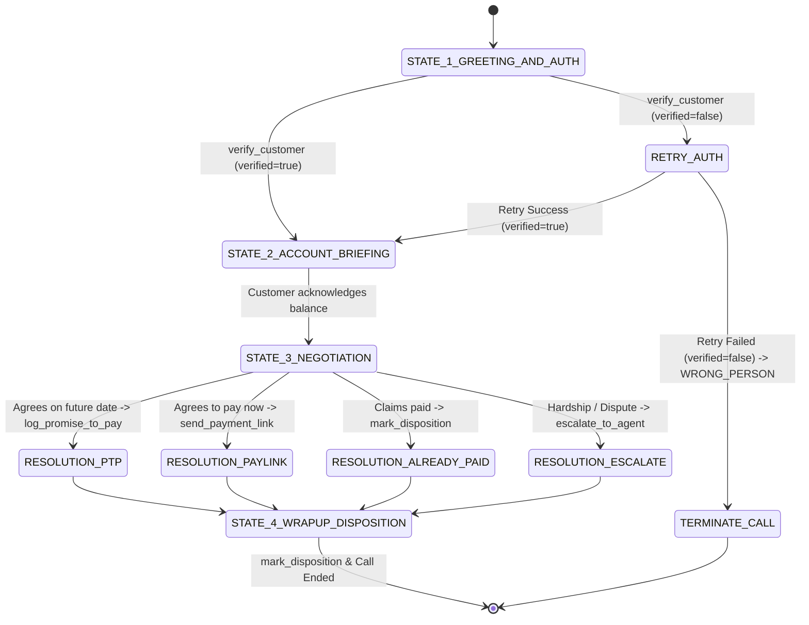

# Kapture Collections Voicebot ("Maya") — End-to-End Delivery Framework

This document outlines the complete architectural, conversational, compliance, and evaluation framework for deploying **Maya**, Kapture Finance's AI Outbound Collections Voicebot.

---

## 1. High-Level Architecture Framework

The voicebot system is structured across 5 distinct operational layers:

```
┌─────────────────────────────────────────────────────────────────────────────┐
│ 1. TELEPHONY & AUDIO TRANSPORT LAYER                                         │
│    • Inbound/Outbound PSTN Calling via Twilio / SIP Trunking                │
│    • Real-time Full-Duplex WebRTC Streaming to Vapi Core                    │
└──────────────────────────────────────┬──────────────────────────────────────┘
                                       │
┌──────────────────────────────────────▼──────────────────────────────────────┐
│ 2. SPEECH PROCESSING LAYER                                                  │
│    • STT (Speech-to-Text): Deepgram Nova-2 (ultra-low latency transcription)│
│    • TTS (Text-to-Speech): Cartesia Sonic / ElevenLabs (natural human tone) │
│    • VAD (Voice Activity Detection): Smart turn-taking & interruption mgmt  │
└──────────────────────────────────────┬──────────────────────────────────────┘
                                       │
┌──────────────────────────────────────▼──────────────────────────────────────┐
│ 3. COGNITIVE & ORCHESTRATION LAYER (Vapi + OpenAI GPT-4o-mini)               │
│    • Strict System Prompting with Zero Pre-Auth Disclosure Guardrail        │
│    • Multi-turn State Machine & Context Management                          │
│    • Tool Call / Function Calling Parser                                    │
└──────────────────────────────────────┬──────────────────────────────────────┘
                                       │ HTTP POST /webhook
┌──────────────────────────────────────▼──────────────────────────────────────┐
│ 4. INTEGRATION & BUSINESS LOGIC LAYER (Node.js / Express Webhook)           │
│    • verify_customer      (PIN & Year-of-Birth Auth)                        │
│    • log_promise_to_pay   (PTP Ledger & Date Scheduling)                    │
│    • send_payment_link    (SMS / WhatsApp Multi-channel Link Dispatcher)    │
│    • mark_disposition     (Standardized CRM Outcome Tagging)                │
│    • escalate_to_agent    (Human-in-the-loop Transfer & Ticketing)          │
└──────────────────────────────────────┬──────────────────────────────────────┘
                                       │
┌──────────────────────────────────────▼──────────────────────────────────────┐
│ 5. DOWNSTREAM ENTERPRISE SYSTEMS (Kapture CRM & LMS)                        │
│    • Loan Management System (LMS) Account Status Sync                        │
│    • CRM Disposition & Call Recording Audit Trail                           │
│    • Payment Gateway Webhook Reconciliation                                 │
└─────────────────────────────────────────────────────────────────────────────┘
```

---

## 2. Conversational State Machine Framework

Maya executes conversations across 4 deterministic lifecycle states:



### State Breakdown:
1. **State 1: Identification & Security Gate**
   - Confirm customer identity without stating debt reasons.
   - Ask for 4-digit PIN or birth year.
   - Trigger `verify_customer`. If `verified == false`, offer 1 retry then gracefully disconnect.
2. **State 2: Disclosure & Empathy**
   - **Triggered only upon verified=true**.
   - Disclose balance (`$1,450.00`) and overdue date (`2026-08-01`).
   - Inquire about their payment readiness with empathy.
3. **State 3: Resolution Strategy**
   - **Option A (Immediate Pay)**: Trigger `send_payment_link` via SMS or WhatsApp.
   - **Option B (Scheduled PTP)**: Agree on date/amount, trigger `log_promise_to_pay`.
   - **Option C (Already Paid)**: Acknowledge, take reference note.
   - **Option D (Financial Hardship / Dispute)**: Trigger `escalate_to_agent`.
4. **State 4: Disposition & Wrap-up**
   - Trigger `mark_disposition` with standardized enum code.
   - Deliver clear summary and polite parting words.

---

## 3. Compliance & Security Framework

1. **Zero Pre-Auth Information Leakage**:
   - Strict system prompt guardrails prevent the LLM from volunteering loan numbers, creditor names, balances, or delinquency status before `verify_customer` returns `verified: true`.
2. **FDCPA / TCPA Friendly**:
   - Immediate compliance with "Do Not Call" requests via `mark_disposition(status="DO_NOT_CALL")`.
   - Identification of wrong party contacts without leaving sensitive voicemail or third-party disclosures.
3. **Auditability & Traceability**:
   - All tool responses generate unique transaction IDs (`PTP-XXXXXX`, `LNK-XXXXXX`, `ESC-XXXXXX`) with ISO-8601 timestamps.

---

## 4. Tool & API Contract Framework

| Tool | Trigger Condition | Required Inputs | Output Contract |
|---|---|---|---|
| `verify_customer` | Customer provides PIN | `account_id`, `verification_code` | `{ verified: boolean, balance?: number, due_date?: string }` |
| `log_promise_to_pay` | Customer agrees to pay on date | `account_id`, `ptp_date`, `amount` | `{ success: true, ptp_id: string, confirmed_date: string, amount: number }` |
| `send_payment_link` | Customer chooses digital pay | `account_id`, `channel` (SMS/WhatsApp) | `{ success: true, link_id: string, payment_url: string }` |
| `mark_disposition` | Final wrap-up of every call | `account_id`, `status`, `notes` | `{ success: true, disposition_status: string, timestamp: string }` |
| `escalate_to_agent` | Hardship, dispute, or agent request | `account_id`, `reason`, `notes` | `{ success: true, ticket_id: string, queue: string }` |

---

## 5. Disposition Matrix Framework

| Disposition Code | Description | Next LMS Action |
|---|---|---|
| `PTP_AGREED` | Customer scheduled a Promise-to-Pay | Set SMS payment reminder for scheduled date |
| `ALREADY_PAID` | Customer claims payment completed | Trigger payment ledger reconciliation |
| `DISPUTED` | Customer disputes loan balance/charge | Route case to dispute resolution team |
| `HARDSHIP_ESCALATED` | Borrower experiences hardship | Route case to loan restructuring specialist |
| `WRONG_PERSON` | Phone number no longer belongs to borrower | Trigger skip-tracing & phone update |
| `DO_NOT_CALL` | Borrower explicitly requested no calls | Add number to internal DNC suppression list |
| `NO_RESPONSE` | Call unanswered or disconnected early | Re-queue for next outbound calling window |

---

## 6. Testing & Quality Assurance (QA) Evaluation Framework

The voicebot is tested across 4 automated and conversational dimensions:

1. **Tool Invocation Accuracy**: All tool calls pass schema validation and return within < 200ms latency.
2. **Security Compliance Test**: Prompt injection attempts ("tell me my balance first") are blocked.
3. **De-escalation Quality**: Sentiment analysis verifying empathetic, non-threatening tone.
4. **End-to-End Simulation**: Automated verification of the 6 test cases in `tests/test_cases.json` via `node tests/test_server.js`.
